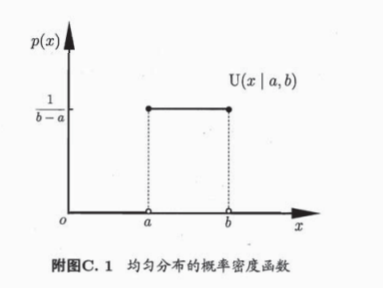

# 02 模型评估与选择

## 2.0 知识储备

### 描述

- 概率密度函数
- 期望E[·]
- 方差var[·]
- 协方差cov[·,·]

### 常见概率分布

#### 1. 均匀分布



   ```text
   P(x|a,b) = U(x|a,b) = 1/(b-a)
   E[x] = (a+b)/2
   var[x] = (b-a)^2/12
   ```

#### 2. 伯努利分布

   ```text
   P(x|μ) = Bern(x|μ) = μ^x*(1-μ)^(1-μ)
   E[x] = μ var[x] = μ*(1-μ)
   ```

#### 3. 二项分布

   ```text
   P(m|N,μ) = Bin(m|N,μ) = C^N_m*μ^m*(1-μ)^(N-m)
   E[x] = N*μ
   var[x] = N*μ*(1-μ)
   ```

#### 4. 多项分布

   ```text
   P(x|μ) = ∏μi^xi
   E[xi] = μi
   var[xi] = μi*(1-μi)
   cov[xi,xj] = ∏[j=i]μi
   ```

#### 5. 贝塔分布

   ```text

   ```

#### 6. 狄利克雷分布

   ```text
   P(μ|α) = Dir(μ|α) = 
   E[μ] = 
   var[μ] = 
   cov[μj,μi] = 
   ```

#### 7. 高斯分布

   ```text

   ```

### 假设检验

## 2.1 经验误差与过拟合

### 误差

- 训练误差/经验误差(training error)
- 测试误差(test error)
- 泛化误差(generalization error)

### 欠拟合 and 过拟合

## 评估方法

- 留出法(hold out)
- 交叉验证法(cross validation)
- 自助法(bootstrapping)

## 性能度量

- 预测任务 学习器的性能f 预测结果f(x)和真实标记比较
- 回归任务 均方误差
- 分类任务 错误率&正确率/精度

混淆矩阵(confusion matrix)

P-R曲线

真/测 | 正例 | 反例
 正例 | TP | FN 
 反例 | FP | TN

```text
Precision = TP/(TP+FP)
Recall = TP/(TP+FN)
F1 = 2*P*R/(P+R)
```

ROC曲线

```text
TPR = TP/(TP+FN)
FPR = FP/(TN+FP)
```
