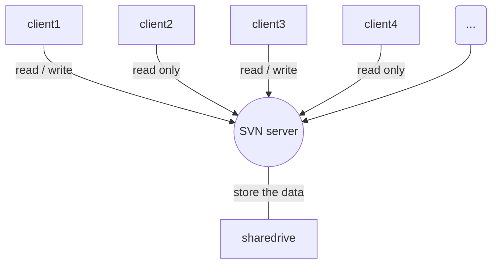

# h1

## h2

### h3

#### h4

##### h5

###### h6

**加粗**
*斜体*
***加粗+斜体***
~~删除线~~

> 引用
>> 引用

分割线

---


[//]: # 注释

<!--
注释
-->


图片alt就是显示在图片下面的文字，相当于对图片内容的解释。 图片title是图片的标题，当鼠标移到图片上时显示的内容。title可加可不加

[超链接名](超链接地址 "超链接title")
title可加可不加

无序列表

- 1
    - 2
        - 3

有序列表

1. 1
    1. 2
        1. 3
            1. 4

表格 表头|表头|表头 ---|:--:|---:
内容|内容|内容 内容|内容|内容 第二行分割表头和内容。 有一个就行，为了对齐，多加了几个 文字默认居左 -两边加：表示文字居中 -右边加：表示文字居右 注：原生的语法两边都要用 | 包起来。此处省略

`p`

```python
print('hello')
print('hello')
```

流程图

```flow
st=>start: Start
op=>operation: My Operation
cond=>condition: Yes or No?
e=>end
st->op->cond
cond(yes)->e
cond(no)->op
```

---

```flow
st=>start: Start|past:>http://www.google.com[blank]
e=>end: End:>http://www.google.com
op1=>operation: get_hotel_ids|past
op2=>operation: get_proxy|current
sub1=>subroutine: get_proxy|current
op3=>operation: save_comment|current
op4=>operation: set_sentiment|current
op5=>operation: set_record|current

cond1=>condition: ids_remain空?
cond2=>condition: proxy_list空?
cond3=>condition: ids_got空?
cond4=>condition: 爬取成功??
cond5=>condition: ids_remain空?

io1=>inputoutput: ids-remain
io2=>inputoutput: proxy_list
io3=>inputoutput: ids-got

st->op1(right)->io1->cond1
cond1(yes)->sub1->io2->cond2
cond2(no)->op3
cond2(yes)->sub1
cond1(no)->op3->cond4
cond4(yes)->io3->cond3
cond4(no)->io1
cond3(no)->op4
cond3(yes, right)->cond5
cond5(yes)->op5
cond5(no)->cond3
op5->e
```

---


